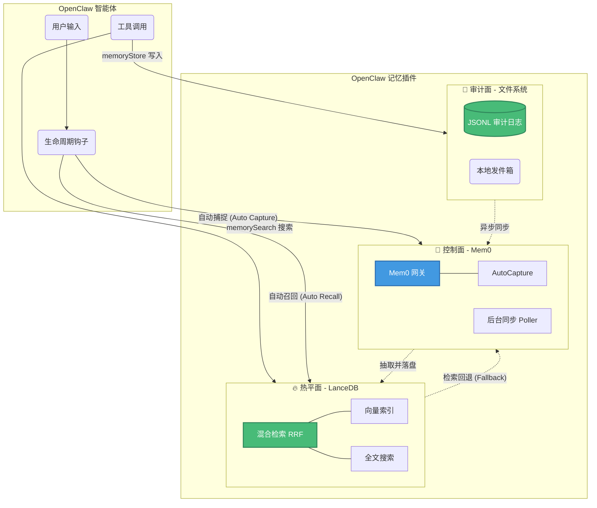

<div align="center">
  <h1>OpenClaw 记忆插件 (Mem0 + LanceDB)</h1>
  <p><strong>🧠 为你的 AI 智能体注入持久化、智能化的长期记忆 🧠</strong></p>
  <p>
    <a href="./README.md">English Documentation</a>
  </p>
</div>

---

**OpenClaw-Mem0-LanceDB** 是一款高级记忆插件，赋予 OpenClaw 智能体长期记忆与持续学习的能力。它完美结合了 **[Mem0](https://github.com/mem0ai/mem0)**（作为智能的控制面进行记忆抽取和管理）与 **[LanceDB](https://github.com/lancedb/lancedb)**（作为基于向量和全文检索的极速检索热面）。

无论你是希望赋予 Agent 稳定人设的初学者，还是正在构建可扩展多智能体系统的资深研发人员，本插件都能满足你的需求。

---

## 🏗️ 架构概览 (Architecture Overview)

本插件采用了**三平面内嵌架构 (Tri-Plane Embedded Architecture)**，旨在提供极致的稳定性、极速的检索能力以及完美的可审计性。



### 核心三平面设计
1. **📝 审计面 (Audit Plane - 事实来源)**：基于文件系统的追加写（Append-only）JSONL 日志 (`auditStorePath`)。确保记忆永不丢失，并提供对人类友好的操作追溯能力。
2. **🔥 热平面 (Hot Plane - 检索层)**：由 LanceDB 驱动，提供极速的混合检索（向量检索 + FTS 全文检索 + RRF 倒数综合排序），为每次对话提供即时上下文。
3. **🧠 控制面 (Control Plane - 智能层)**：连接 Mem0（本地或云端服务），智能地从对话记录中抽取实体、用户偏好和事实，并负责跨设备的记忆同步。

---

## 🚀 快速开始 (适合初学者)

让你的 Agent 瞬间拥有记忆！

### 1. 安装

在 OpenClaw 工作区中运行安装脚本：

```bash
cd plugins/openclaw-mem0-lancedb
bash scripts/install.sh
```

### 2. 配置

在 `openclaw.json` 配置中添加本插件。以下是推荐的极简配置（使用本地 Mem0 服务）：

```json
{
  "plugins": {
    "slots": {
      "memory": "openclaw-mem0-lancedb"
    },
    "entries": {
      "openclaw-mem0-lancedb": {
        "enabled": true,
        "config": {
          "mem0": {
            "mode": "local",
            "baseUrl": "http://127.0.0.1:8000",
            "apiKey": ""
          },
          "lancedbPath": "~/.openclaw/workspace/data/memory/lancedb",
          "outboxDbPath": "~/.openclaw/workspace/data/memory/outbox.json",
          "auditStorePath": "~/.openclaw/workspace/data/memory/audit/memory_records.jsonl",
          "autoRecall": {
            "enabled": true,
            "topK": 5,
            "maxChars": 800,
            "scope": "all"
          },
          "autoCapture": {
            "enabled": true
          }
        }
      }
    }
  }
}
```

*提示：开启 `autoCapture` 和 `autoRecall` 后，Agent 将全自动运作，自动从对话中学习并记住关键信息，而无需显式调用记忆提取工具！*

### 高阶推荐：Voyage AI (最佳检索体验)

在生产环境中，如果你需要极高的语义召回率与排序准确度，我们强烈推荐使用 [Voyage AI](https://www.voyageai.com/) 的 Embedding 和 Rerank 服务。

---

## 🛠️ 深度探索：工具与能力 (适合研发人员)

插件同时暴露了可以直接调用的高级工具，供复杂的 Agent 编排使用：

### 🔍 `memory_search` & `memorySearch`
核心的高频检索工具。优先命中 LanceDB 热面的混合检索（向量 + BM25 全文检索），在数据稀疏时智能回退到 Mem0。

```json
{
  "query": "用户的饮食偏好",
  "userId": "user_123",
  "topK": 5,
  "filters": {
    "scope": "long-term",
    "categories": ["preference"]
  }
}
```

### 💾 `memoryStore`
显式落盘一条记忆。写入链路具有事务级安全性保证：
`Agent -> Audit 面落地 -> 本地 Outbox -> 同步 Mem0 控制面 -> 写入 LanceDB 热面更新索引`

```json
{
  "text": "用户喜欢科幻电影，特别喜欢星际穿越。",
  "userId": "user_123",
  "scope": "long-term",
  "categories": ["preference", "entertainment"]
}
```

### 📖 `memory_get`
直接从文件审计系统中读取原始 JSONL 日志切片，用于底层状态排障或构建时间线回溯分析分析。

---

## 🤖 全自动生命周期管理 (Hooks)

只要 OpenClaw 宿主环境支持标准钩子 (`before_prompt_build`, `agent_end`)，该插件就能做到黑盒自动运行：

### 📥 自动捕捉 Auto Capture (无感持续学习)
回合结束（`agent_end`）时触发。插件会将最近一轮的 `User + Assistant` 对话提交至 Mem0。Mem0 会在后台进行智能特征提取（识别偏好更新、事实新增或修正），然后异步将提炼后的原子记忆同步回本地 LanceDB，完成长期学习过程。

### 📤 自动召回 Auto Recall (零微调上下文注入)
在 Agent 还没思考前（`before_prompt_build`），插件自动截获最新用户的 Query 查询，对内请求 LanceDB 混合检索，将匹配到的记忆段落在 Prompt 最前方注入格式化的 `<relevant_memories>` 上下文块。让大模型具备即时的历史感知。

---

## 🔧 本地服务端开发指南

我们强烈建议使用本地拉起的 Mem0 测试服务调试插件，告别缓慢的公网延迟与接口授权困扰。

1. **环境准备**: 确保你已安装极速包管理器 `uv` (`pip install uv`)。
2. **初始化环境**: 运行 `npm run mem0:setup`。它会自动创建隔离的 Python 虚拟环境，并安装本地服务器所需依赖包（已内置针对 Gemini 降级的 `google-genai`）。
3. **拉起服务**: 运行 `npm run mem0:start` (默认监听 `127.0.0.1:8000`)。

本地服务端极其智能地继承了 `~/.openclaw/openclaw.json` 中配置的 LLM default 节点信息（`agents.defaults.memorySearch`），自动加载 Embedding Provider 和 API Key，做到零配置热启动。

### 常用开发指令
```bash
npm install      # 安装核心 JS 依赖
npm run dev      # 启动 TypeScript 热编译
npm run build    # 打包构建发布版本
npm test         # 执行单元测试套件
```
